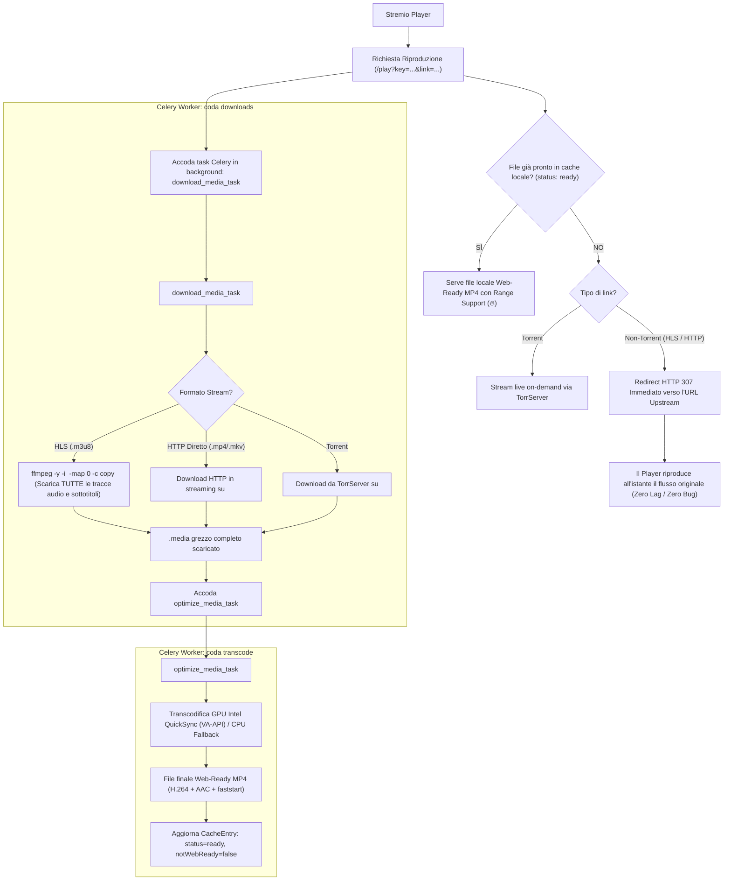

# Piano di Architettura: Semplificazione Flussi non-Torrent, Eliminazione MediaFlow e Migrazione a Celery

Questo documento formalizza l'architettura aggiornata per:
1. **Eliminazione completa di MediaFlow e delle variabili legacy** (`MEDIAFLOW_*`, `HTTP_STREAMS_*`).
2. **Semplificazione radicale dei flussi non-torrent (HLS / HTTP)**: riproduzione live trasparente via 307 redirect, cattura offline completa con `ffmpeg` multilingua e transcodifica GPU unificata a MP4 Web-Ready.
3. **Migrazione del sistema di code/worker a Celery + Redis** (ispirato al pattern collaudato in `tubecast` e conforme alle regole architetturali in `AGENTS.md`).

---

## 1. Variabili e Logiche da Eliminare

In conformità con i requisiti, eliminiamo le seguenti variabili d'ambiente e tutto il codice correlato:

| Variabile / Componente | Azione | Motivo |
| :--- | :---: | :--- |
| `MEDIAFLOW_BASE_URL` | **Eliminare** | Disaccoppiamento totale da MediaFlow. Nessun proxy esterno intermedio. |
| `MEDIAFLOW_API_PASSWORD` | **Eliminare** | Non più necessaria. |
| `MEDIAFLOW_ENABLED` | **Eliminare** | Non più necessaria. |
| `HTTP_STREAMS_PROXY_ENABLED` | **Eliminare** | Tutti i flussi non-torrent seguono la stessa pipeline unificata senza switch condizionali. |
| `HTTP_STREAMS_PASSTHROUGH` | **Eliminare** | Ridondante. |
| `MediaflowClient` (`stremio_http_proxy/client/mediaflow_client.py`) | **Eliminare file** | Tutta la logica di generazione URL MediaFlow e fix manifest rimossa. |
| `HlsChunkManager` (`stremio_http_proxy/manager/hls_chunk_manager.py`) | **Eliminare file** | Niente più download a pezzetti `.ts`, né riscrittura manifest riga per riga. |
| Rotte `/play/manifest.m3u8`, `/play/variant.m3u8`, `/play/chunk` | **Eliminare** | Il player riceve un redirect diretto all'upstream per il live, oppure il file MP4 unificato dalla cache locale. |
| Tabella `task_entry` e `TaskService` legacy | **Eliminare** | Sostituiti nativamente da Celery + Redis. |

---

## 2. Nuovo Modello Flussi non-Torrent (HLS e HTTP Diretti)

### Flusso di Riproduzione e Caching

### Punti di Forza:
1. **Riproduzione Istantanea**: La riproduzione live non aspetta il proxy né riscrive playlist. Il redirect 307 rimanda il player direttamente al sorgente.
2. **Cattura Completa Multilingua**: `ffmpeg -map 0 -c copy` scarica in locale il flusso HLS completo, preservando **ogni traccia audio e lingua presente**, oltre ai sottotitoli.
3. **Pipeline di Transcodifica Unica**: Sia i flussi Torrent che HLS e HTTP producono un `.media` grezzo e passano attraverso lo stesso `OptimizeMediaTask` accelerato su GPU.

---

## 3. Riconversione Code e Worker con Celery (Pattern TubeCast)

### A. Broker e Configurazione Infrastrutturale
- **Redis**: Aggiunto container `redis:7-alpine` a `docker-compose.yml` e nei template Ansible di produzione.
- **Configurazione Celery (`stremio_http_proxy/worker.py`)**:
  - `celery_app = Celery("stremio_http_proxy", broker=redis_url, backend=redis_url)`.
  - Lettura diretta di `REDIS_URL` o `CELERY_BROKER_URL` da environment (regola `AGENTS.md`: nessuna classe config).
  - Parametri di stabilità: `task_acks_late=True`, `worker_prefetch_multiplier=1`.

### B. Partizionamento delle Code

| Coda Celery | Concorrenza | Risorse / Passthrough | Tipologia Task |
| :--- | :---: | :--- | :--- |
| **`transcode`** | 1 (o 2) | GPU Intel `/dev/dri` | `OptimizeMediaTask` (conversione MP4 Web-Ready GPU) |
| **`downloads`** | 4 | Network I/O bound | `DownloadMediaTask` (TorrServer, ffmpeg HLS, HTTP) |
| **`default`** | 4 | CPU / Network leggero | `FetchMediaTask`, `FetchNextEpisodeTask`, `EnrichMediaMetadataTask` |

### C. Gestione dei Task Celery
Tutti i task ereditano da `AbstractTask` o usano `@shared_task(bind=True)`.
Le dipendenze vengono risolte tramite `DefaultContainer.getInstance().get(...)`:

1. **`DownloadMediaTask` (`queue="downloads"`)**:
   - Scarica il flusso sorgente su disco (`.media`).
   - Se HLS: esegue `ffmpeg -y -i <url> -map 0 -c copy <dest.media>`.
   - Se Torrent: scarica da TorrServer (arricchendo preventivamente i magnet con i tracker pubblici di default se mancanti).
   - Se HTTP: streaming diretto `httpx`.
   - Al termine lancia `optimize_media_task.apply_async(args=[cache_key], queue="transcode")`.
2. **`OptimizeMediaTask` (`queue="transcode"`)**:
   - Esegue la transcodifica GPU VA-API (o fallback CPU) verso MP4 Web-Ready.
   - Aggiorna `cache_entries` a `status="ready"`.
3. **`Celery Beat` (`stremio_http_proxy/beat.py`)**:
   - Task periodico di pulizia automatica (`cleanup_cache_task`, es. ogni 30 minuti) per rimuovere file scaduti e mantenere la dimensione della cache sotto la soglia massima consentita.

### D. Eliminazione del Codice Legacy
- Rimosso `TaskEntry` / tabella `task_entry`.
- Rimosso `TaskService` (vecchio polling DB con lease lock).
- Rimosso `DownloadWorkerService` (sostituito dai worker Celery nativi).

---

## 4. Fasi Operative di Implementazione

### Fase 1: Rimozione MediaFlow, HlsChunkManager e Pulizia Variabili
- [x] Rimuovere `stremio_http_proxy/client/mediaflow_client.py` e relativi test (`test_mediaflow_client.py`, `test_mediaflow_config.py`, `test_e2e_toastflix_mediaflow.py`).
- [x] Rimuovere `MEDIAFLOW_*`, `HTTP_STREAMS_PROXY_ENABLED`, `HTTP_STREAMS_PASSTHROUGH` da `DefaultContainer` e relativi parametri di iniezione.
- [x] Ripulire `StreamRewriteService`: rimuovere tutta la logica MediaFlow (`_needs_mediaflow_proxy`, `_extract_proxy_headers`, `fix_mediaflow_url`), lasciando unicamente la riscrittura URL pulita e l'arricchimento con stato cache.
- [x] Rimuovere `HlsChunkManager` (`stremio_http_proxy/manager/hls_chunk_manager.py`) e relativi test.
- [x] In `PlaybackController`:
  - Eliminare le rotte `/play/manifest.m3u8`, `/play/variant.m3u8`, `/play/chunk`.
  - Aggiornare `/play`: per flussi non-torrent non in cache, restituire immediatamente `RedirectResponse(url=link, status_code=307)`.

### Fase 2: Downloader HLS con ffmpeg e Arricchimento Tracker
- [x] Implementare nel download service la cattura HLS via `ffmpeg -y -i <url> -map 0 -c copy <dest.media>` con supporto per tutte le tracce audio/sub.
- [x] In `TorrServerClient`, inserire l'arricchimento automatico dei magnet/infohash con i tracker pubblici di default (`opentrackr.org`, ecc.) se il link in ingresso ne è privo.

### Fase 3: Setup Celery & Redis
- [x] Aggiungere `celery` e `redis` in `pyproject.toml`.
- [x] Creare `stremio_http_proxy/worker.py` (inizializzazione Celery, configurazione code).
- [x] Creare `stremio_http_proxy/beat.py` (schedulazione Celery Beat per manutenzione cache).
- [x] Riconvertire i task (`DownloadMediaTask`, `OptimizeMediaTask`, `FetchNextEpisodeTask`, ecc.) in `@shared_task` Celery con DI via `DefaultContainer`.
- [x] Supporto Celery dispatcher per i servizi e task periodic cache cleanup.

### Fase 4: Aggiornamento Docker e Ansible
- [x] Aggiungere servizio `redis:7-alpine` in `docker-compose.yml`.
- [x] Aggiornare il servizio `worker` in `docker-compose.yml` per eseguire Celery worker sulle code `transcode`, `downloads`, `default`.
- [x] Aggiungere il servizio `beat` in `docker-compose.yml`.
- [x] Aggiornare i ruoli e template Ansible in `capimichi-home`.

### Fase 5: Suite di Test e Verifica
- [x] Aggiornare i test unitari e di integrazione in `tests/` eliminando i riferimenti a MediaFlow e adattando i mock a Celery.
- [x] Eseguire `pytest` su tutta la suite.
- [x] Verificare il comportamento con flussi live HLS e torrent.
